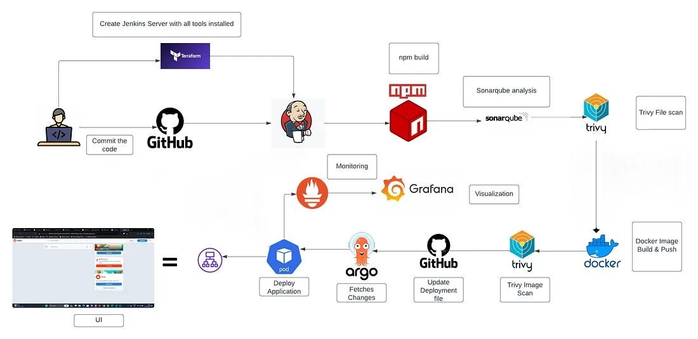

In this End-to-End DevSecOps project, We successfully deployed a Reddit Clone App leveraging Jenkins for Continuous Integration/Continuous Deployment (CI/CD) pipelines, seamlessly integrated with Amazon EKS (Elastic Kubernetes Service), and managed deployment through Argo CD, ensuring a secure, scalable, and automated infrastructure.

